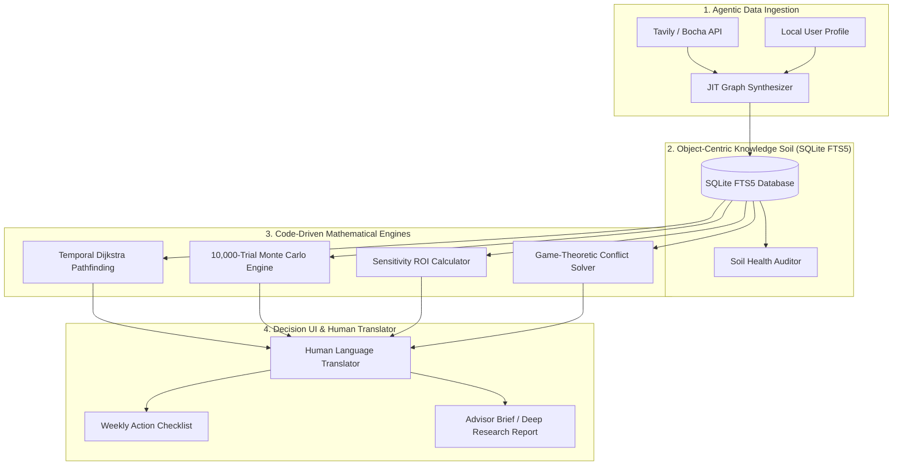

# LifeTree (人生树) — Personal Decision Intelligence System (Life OS)

<p align="center">
  
</p>

<p align="center">
  <strong>Palantir-Grade Temporal GraphRAG & Code-Driven Monte Carlo Personal Decision Operating System</strong>
</p>

<p align="center">
  <a href="#-table-of-contents"></a>
  <a href="#-architecture--tech-stack"></a>
  <a href="#-key-innovations"></a>
  <a href="#-license"></a>
</p>

---

## 📖 Table of Contents

- [🌟 System Philosophy & Metaphor](#-system-philosophy--metaphor)
- [🏗️ Architecture & Tech Stack](#️-architecture--tech-stack)
- [🚀 Key Innovations](#-key-innovations)
- [📁 Repository & Skill Structure](#-repository--skill-structure)
- [💻 Quick Start & Engine Execution](#-quick-start--engine-execution)
- [📄 License](#-license)

---

## 🌟 System Philosophy & Metaphor

LifeTree (人生树) is a next-generation **Personal Decision Intelligence (PDI) Operating System (Life OS)**. It bridges public policy networks, macroeconomic trends, regulatory laws, and personal life choices into an interactive, dynamic decision-tree architecture with real-time risk hedging, code-driven stochastic forecasting, and game-theoretic conflict resolution.

```
                  ┌─────────────────────────────────────────┐
                  │          The Tree / Fate (树/命运)       │
                  │   Personal Goals, Values & Options      │
                  └────────────────────┬────────────────────┘
                                       │
                                       ▼
                  ┌─────────────────────────────────────────┐
                  │       The Soil / Network (网/土壤)       │
                  │   Public Policy, Tax Codes & Laws       │
                  └─────────────────────────────────────────┘
```

- **The Soil / Network (网/土壤)**: Public policies, statutes, geopolitical shifts, tax treaties, and market constraints forming a dynamic reality knowledge graph.
- **The Tree / Fate (树/命运)**: The user's personal profile, goals, and decision choices growing like a tree out of the knowledge soil.
- **Core Claim**: *The Soil provides objective facts and resistance; the Tree presents personal choices and possibilities, ensuring every major decision maintains controllable "Plan B side buds".*

---

## 🏗️ Architecture & Tech Stack



### 🛠️ Tech Stack Specification

| Component | Technology | Description |
| :--- | :--- | :--- |
| **Core Logic** | Python 3.10+ | Zero-dependency, modular calculation & inference engine |
| **Local Storage** | SQLite3 + FTS5 | Embedded DB with WAL mode concurrency & full-text search |
| **Graph Algorithm** | Dijkstra & BFS | Lowest-friction causal pathfinding & N-hop risk cascades |
| **Stochastic Engine**| Monte Carlo (10k Trials) | Gaussian processing delays & Lognormal cost inflation shocks |
| **Web Ingestion** | Tavily & Bocha API | Site-specific domain filtering & `/extract` webpage crawling |
| **Decision Science**| Game Theory & Pareto | Pareto-optimal compromise solver & ROI elasticity derivatives |

---

## 🚀 Key Innovations

> [!IMPORTANT]
> **STRICT CODE-DRIVEN MATHEMATICAL ENGINE**:
> All probabilistic simulations, Value at Risk (VaR) calculations, Dijkstra causal pathfinding, sensitivity ROIs, and friction matrices are strictly computed by executing Python tools in `scripts/` or querying the embedded zero-dependency local SQLite database (`resources/database/lifetree_local_db.sqlite`). No mathematical calculations are guessed or manually estimated by LLM text generation!

### 1. Embedded Zero-Dependency Local SQLite Database (`sqlite3`)
- Uses Python's built-in `sqlite3` library (zero pip/server installation).
- Stores Object Nodes, Kinetic Links, Global User Memory, Decision Journals, and Risk Surveillance Registries in local file `lifetree_local_db.sqlite`.
- High-performance SQL indexed graph traversal, active temporal filtering, and sub-millisecond poison node purging.

### 2. Object-Centric Dynamic Ontology & GraphRAG
- **Dynamic Ontology Objects**: `PERSON`, `REGULATION_LAW`, `PATHWAY_ROUTE`, `CAPITAL_ASSET`, `INSTITUTION_AGENCY`, `MACRO_EVENT`, `ACTION`.
- **Kinetic Links**: Directional, weighted, temporal relations (`DEPENDS_ON`, `GOVERNS`, `REQUIRES_CAPITAL`, `TRIGGERS_EVENT`, `MUTATES_STATE`, `CONFLICTS_WITH`).
- **Dijkstra Causal Pathfinding**: Calculates optimal lowest-friction / highest-confidence causal routes connecting user objects to target pathway goals via Python code execution.

### 3. 10,000-Trial Monte Carlo Stochastic Simulation & Value at Risk (VaR)
- Runs 10,000 stochastic simulation trials over decision pathways.
- Models Gaussian processing delays and Lognormal cost inflation shocks.
- Calculates **P10 (optimistic), P50 (median), P90 (pessimistic)** completion timelines, financial capital requirements, and 95% Value at Risk (VaR).

### 4. Sensitivity Elasticity & Personal Action ROI Calculator
- Computes partial elasticity $\frac{\partial \text{Probability}}{\partial \text{Variable}}$ across user profile parameters.
- Ranks personal actions by Return on Investment (ROI), identifying the single personal action (e.g. language exam vs capital deposit) that yields maximum marginal success.

---

## 📁 Repository & Skill Structure

```
lifetree/
├── SKILL.md                            # Master Operational Directives
├── README.md                           # Comprehensive Technical Manual
├── scripts/                            # Categorized Python Engines & Tools
│   ├── graph_engines/                  # GraphRAG, Pathfinding & SQLite Storage
│   │   ├── temporal_graph_engine.py
│   │   ├── sqlite_graph_store.py
│   │   ├── graph_confidence_filter.py
│   │   ├── graph_rehabilitation_engine.py
│   │   └── soil_health_auditor.py
│   ├── simulation_engines/             # Monte Carlo & Temporal Deduction
│   │   ├── monte_carlo_decision_engine.py
│   │   ├── deduction_simulation_engine.py
│   │   ├── deduction_interactive_controller.py
│   │   ├── confidence_decay_pattern_engine.py
│   │   └── long_term_data_store.py
│   ├── decision_analysis/              # Sensitivity, Game Theory & Trade-Offs
│   │   ├── graph_sensitivity_engine.py
│   │   ├── game_theory_stakeholder_solver.py
│   │   ├── risk_reward_frontier.py
│   │   ├── scenario_comparison_matrix.py
│   │   ├── decision_tree_engine.py
│   │   ├── decision_journal_auditor.py
│   │   └── rule_evaluator_engine.py
│   ├── risk_surveillance/              # Latent Risk Discovery & Surveillance
│   │   ├── divergent_risk_discovery.py
│   │   ├── risk_surveillance_tracker.py
│   │   ├── ripple_effect_calculator.py
│   │   └── event_push_diff_engine.py
│   ├── data_connectors/                # Search & Memory Connectors
│   │   ├── search_connector_tavily.py
│   │   ├── jit_connector_synthesizer.py
│   │   └── user_memory_manager.py
│   ├── ui_translators/                 # Human Translators & Action Checklists
│   │   ├── human_translator.py
│   │   ├── action_checklist_generator.py
│   │   └── i18n_report_formatter.py
│   └── run_mvp_workflow.py             # End-to-End Workflow Execution Test Runner
├── resources/                          # Schemas, Databases & Templates
│   ├── schemas/                        # JSON Schemas & UI Specifications
│   ├── database/                       # Database DDL & SQLite Storage
│   └── templates/                      # Export Markdown Templates
├── references/                         # 21 Reference Architecture Subdocs
└── examples/                          # Example Profile & Graph Inputs
```

---

## 💻 Quick Start & Engine Execution

### 1. Run Complete End-to-End MVP Decision Pipeline
```bash
python3 .agent/skills/lifetree/scripts/run_mvp_workflow.py
```

### 2. Run Embedded Local SQLite Database Manager (FTS5 Search)
```bash
python3 .agent/skills/lifetree/scripts/graph_engines/sqlite_graph_store.py
```

### 3. Run 10,000-Trial Monte Carlo Stochastic Simulation & VaR
```bash
python3 .agent/skills/lifetree/scripts/simulation_engines/monte_carlo_decision_engine.py
```

---

## 📄 License

This project is licensed under the **MIT License** - see the [LICENSE](LICENSE) file for details.

```
MIT License

Copyright (c) 2026 LifeTree Systems

Permission is hereby granted, free of charge, to any person obtaining a copy
of this software and associated documentation files (the "Software"), to deal
in the Software without restriction, including without limitation the rights
to use, copy, modify, merge, publish, distribute, sublicense, and/or sell
copies of the Software, and to permit persons to whom it is furnished to do so.
```
