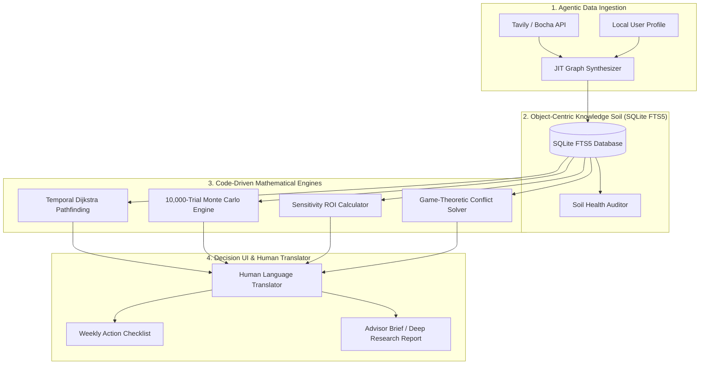

# LifeTree (人生树) — Personal Decision Intelligence System (Life OS)

<p align="center">
  
</p>

<p align="center">
  <strong>Object-Centric Temporal GraphRAG & Code-Driven Monte Carlo Personal Decision Operating System</strong>
</p>

<p align="center">
  <a href="README.md"><strong>English</strong></a> | 
  <a href="README_zh.md"><strong>简体中文</strong></a> | 
  <a href="README_de.md"><strong>Deutsch</strong></a>
</p>

<p align="center">
  <a href="#-table-of-contents"></a>
  <a href="#-architecture--tech-stack"></a>
  <a href="#-key-innovations"></a>
  <a href="#-license"></a>
</p>

---

## 📖 Table of Contents

- [🤖 How AI Agents Should Use This Skill](#-how-ai-agents-should-use-this-skill)
- [🌟 System Philosophy & Metaphor](#-system-philosophy--metaphor)
- [🏗️ Architecture & Tech Stack](#️-architecture--tech-stack)
- [🚀 Key Innovations](#-key-innovations)
- [📁 Repository & Skill Structure](#-repository--skill-structure)
- [💻 Quick Start & Engine Execution](#-quick-start--engine-execution)
- [📄 License](#-license)

---

## 🤖 How AI Agents Should Use This Skill

When an AI Agent is tasked with solving complex personal decisions (global mobility, asset allocation, career pivots, tax optimization), follow this **5-Step Operational Protocol**:

### Step 1: Read the Skill Directives
Read `SKILL.md` first to understand active domain rules, local SQLite database schemas, and Python calculation engines.

### Step 2: Query Embedded Local SQLite Database
Search active nodes via FTS5 full-text search before asking the user for duplicate information:
```bash
python3 scripts/graph_engines/sqlite_graph_store.py "blocked account"
```

### Step 3: Run Agentic Web Search & JIT Data Ingestion
Use Tavily / Bocha search tool to fetch latest statutory policies, then synthesize facts into the ontology graph:
```bash
python3 scripts/data_connectors/search_connector_tavily.py "Germany chanceskarte statutory deposit 2026"
python3 scripts/data_connectors/jit_connector_synthesizer.py
```

### Step 4: Execute Code-Driven Mathematical Engines (MANDATORY)
> [!IMPORTANT]
> **NEVER GUESS MATH VIA LLM TEXT GENERATION**:
> Always execute the Python scripts in `scripts/` to calculate shortest paths, Monte Carlo trials, sensitivity ROIs, and VaR budget limits:
```bash
# 1. Calculate Dijkstra Optimal Path & Risk Cascades
python3 scripts/graph_engines/temporal_graph_engine.py

# 2. Run 10,000-Trial Monte Carlo Stochastic Simulation & 95% VaR
python3 scripts/simulation_engines/monte_carlo_decision_engine.py

# 3. Calculate Sensitivity Elasticity & Personal Action ROI
python3 scripts/decision_analysis/graph_sensitivity_engine.py

# 4. Solve Game-Theoretic Stakeholder Conflicts
python3 scripts/decision_analysis/game_theory_stakeholder_solver.py
```

### Step 5: Translate to Human Summaries & Weekly Action Checklist
Translate raw mathematical outputs into plain executive summaries and prioritize immediate weekly action items:
```bash
python3 scripts/ui_translators/human_translator.py
python3 scripts/ui_translators/action_checklist_generator.py
```

---

## 🌟 System Philosophy & Metaphor

LifeTree (人生树) is a next-generation **Personal Decision Intelligence (PDI) Operating System (Life OS)**. It bridges public policy networks, macroeconomic trends, regulatory laws, and personal life choices into an interactive, dynamic decision-tree architecture with real-time risk hedging, code-driven stochastic forecasting, and game-theoretic conflict resolution.

- **The Soil / Network (网/土壤)**: Public policies, statutes, geopolitical shifts, tax treaties, and market constraints forming a dynamic reality knowledge graph.
- **The Tree / Fate (树/命运)**: The user's personal profile, goals, and decision choices growing like a tree out of the knowledge soil.
- **Core Claim**: *The Soil provides objective facts and resistance; the Tree presents personal choices and possibilities, ensuring every major decision maintains controllable "Plan B side buds".*

---

## 🏗️ Architecture & Tech Stack



### 🛠️ Tech Stack Specification

| Component | Technology | Description |
| :--- | :--- | :--- |
| **Core Logic** | Python 3.10+ | Zero-dependency, modular calculation & inference engine |
| **Local Storage** | SQLite3 + FTS5 | Embedded DB with WAL mode concurrency & full-text search |
| **Graph Algorithm** | Dijkstra & BFS | Lowest-friction causal pathfinding & N-hop risk cascades |
| **Stochastic Engine**| Monte Carlo (10k Trials) | Gaussian processing delays & Lognormal cost inflation shocks |
| **Web Ingestion** | Tavily & Bocha API | Site-specific domain filtering & `/extract` webpage crawling |
| **Decision Science**| Game Theory & Pareto | Pareto-optimal compromise solver & ROI elasticity derivatives |

---

## 🚀 Key Innovations

### 1. Embedded Zero-Dependency Local SQLite Database (`sqlite3`)
- Uses Python's built-in `sqlite3` library (zero pip/server installation).
- Stores Object Nodes, Kinetic Links, Global User Memory, Decision Journals, and Risk Surveillance Registries in local file `lifetree_local_db.sqlite`.

### 2. Object-Centric Dynamic Ontology & GraphRAG
- **Dynamic Ontology Objects**: `PERSON`, `REGULATION_LAW`, `PATHWAY_ROUTE`, `CAPITAL_ASSET`, `INSTITUTION_AGENCY`, `MACRO_EVENT`, `ACTION`.
- **Kinetic Links**: Directional, weighted, temporal relations (`DEPENDS_ON`, `GOVERNS`, `REQUIRES_CAPITAL`, `TRIGGERS_EVENT`, `MUTATES_STATE`, `CONFLICTS_WITH`).

### 3. 10,000-Trial Monte Carlo Stochastic Simulation & Value at Risk (VaR)
- Runs 10,000 stochastic simulation trials over decision pathways.
- Models Gaussian processing delays and Lognormal cost inflation shocks.
- Calculates **P10 (optimistic), P50 (median), P90 (pessimistic)** completion timelines, financial capital requirements, and 95% Value at Risk (VaR).

### 4. Sensitivity Elasticity & Personal Action ROI Calculator
- Computes partial elasticity $\frac{\partial \text{Probability}}{\partial \text{Variable}}$ across user profile parameters.
- Ranks personal actions by Return on Investment (ROI), identifying the single personal action yielding maximum marginal success.

---

## 📁 Repository & Skill Structure

```
lifetree/
├── SKILL.md                            # Master Operational Directives
├── README.md                           # Comprehensive Technical Manual (English)
├── README_zh.md                        # Technical Manual (Simplified Chinese)
├── README_de.md                        # Technical Manual (German)
├── scripts/                            # Categorized Python Engines & Tools
│   ├── graph_engines/                  # GraphRAG, Pathfinding & SQLite Storage
│   ├── simulation_engines/             # Monte Carlo & Temporal Deduction
│   ├── decision_analysis/              # Sensitivity, Game Theory & Trade-Offs
│   ├── risk_surveillance/              # Latent Risk Discovery & Surveillance
│   ├── data_connectors/                # Search & Memory Connectors
│   ├── ui_translators/                 # Human Translators & Action Checklists
│   └── run_mvp_workflow.py             # End-to-End Workflow Execution Test Runner
├── resources/                          # Schemas, Databases & Templates
├── references/                         # 21 Reference Architecture Subdocs
└── examples/                          # Example Profile & Graph Inputs
```

---

## 💻 Quick Start & Engine Execution

### Run Complete End-to-End MVP Decision Pipeline
```bash
python3 .agent/skills/lifetree/scripts/run_mvp_workflow.py
```

---

## 📄 License

This project is licensed under the **MIT License** - see the [LICENSE](LICENSE) file for details.
