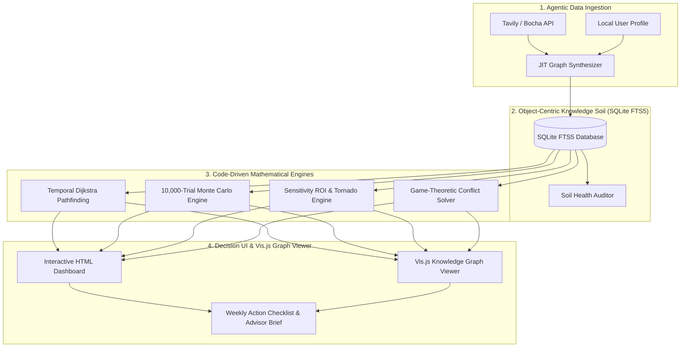

# LifeTree (人生树) — Personal Decision Intelligence System (Life OS)

<p align="center">
  
</p>

<p align="center">
  <strong>Object-Centric Temporal GraphRAG & Code-Driven Monte Carlo Personal Decision Operating System</strong>
</p>

<p align="center">
  <a href="README.md"><strong>English</strong></a> | 
  <a href="README_zh.md"><strong>简体中文</strong></a> | 
  <a href="README_de.md"><strong>Deutsch</strong></a>
</p>

<p align="center">
  <a href="#-anthropic-skill-standard-compliance"></a>
  <a href="#-architecture--tech-stack"></a>
  <a href="#-key-innovations"></a>
  <a href="#-license"></a>
</p>

---

## 📖 Table of Contents

- [🤖 How AI Agents Should Use This Skill](#-how-ai-agents-should-use-this-skill)
- [🎨 Interactive HTML Reports & Graph Viewer](#-interactive-html-reports--graph-viewer)
- [📦 Anthropic Skill Standard Compliance](#-anthropic-skill-standard-compliance)
- [🌟 System Philosophy & Metaphor](#-system-philosophy--metaphor)
- [🏗️ Architecture & Tech Stack](#️-architecture--tech-stack)
- [🚀 Key Innovations](#-key-innovations)
- [📁 Repository & Skill Structure](#-repository--skill-structure)
- [💻 Quick Start & Engine Execution](#-quick-start--engine-execution)
- [📈 Star History](#-star-history)
- [📄 License](#-license)

---

## 🤖 How AI Agents Should Use This Skill

When an AI Agent is tasked with solving complex personal decisions (global mobility, asset allocation, career pivots, tax optimization), follow this **5-Step Operational Protocol**:

### Step 1: Read the Skill Directives
Read `SKILL.md` first to understand active domain rules, local SQLite database schemas, and Python calculation engines.

### Step 2: Query Embedded Local SQLite Database
Search active nodes via FTS5 full-text search before asking the user for duplicate information:
```bash
python3 scripts/graph_engines/sqlite_graph_store.py "blocked account"
```

### Step 3: Run Agentic Web Search & JIT Data Ingestion
Use Tavily / Bocha search tool to fetch latest statutory policies, then synthesize facts into the ontology graph:
```bash
python3 scripts/data_connectors/search_connector_tavily.py "Germany chanceskarte statutory deposit 2026"
python3 scripts/data_connectors/jit_connector_synthesizer.py
```

### Step 4: Execute Code-Driven Mathematical Engines (MANDATORY)
> [!IMPORTANT]
> **NEVER GUESS MATH VIA LLM TEXT GENERATION**:
> Always execute the Python scripts in `scripts/` to calculate shortest paths, Monte Carlo trials, sensitivity ROIs, and VaR budget limits:
```bash
# 1. Calculate Dijkstra Optimal Path & Risk Cascades
python3 scripts/graph_engines/temporal_graph_engine.py

# 2. Run 10,000-Trial Monte Carlo Stochastic Simulation & 95% VaR
python3 scripts/simulation_engines/monte_carlo_decision_engine.py

# 3. Calculate Sensitivity Elasticity & Tornado Diagram Swings
python3 scripts/decision_analysis/graph_sensitivity_engine.py
python3 scripts/decision_analysis/tornado_diagram_engine.py

# 4. Solve Game-Theoretic Stakeholder Conflicts
python3 scripts/decision_analysis/game_theory_stakeholder_solver.py
```

### Step 5: Generate Interactive HTML Dashboard & Dynamic Graph Viewer
Generate self-contained, responsive HTML Decision Dashboards and dynamic Vis.js Knowledge Graph Viewers:
```bash
# 1. Generate Interactive HTML Decision Dashboard
python3 scripts/ui_translators/html_report_generator.py

# 2. Generate Interactive Vis.js Knowledge Graph Viewer
python3 scripts/graph_engines/graph_visualizer_html.py
```

---

## 🎨 Interactive HTML Reports & Graph Viewer

LifeTree automatically exports single-file, self-contained HTML visual artifacts:

1. **Interactive HTML Decision Dashboard (`lifetree_decision_report.html`)**:
   - Executive Metric Cards (P50 Timeline, 95% VaR Budget, Regret Score).
   - Interactive Weekly Action Checklist with To-Do Checkboxes.
   - Interactive Chart.js Monte Carlo Confidence Distribution Gauges.
2. **Dynamic Vis.js Knowledge Graph Viewer (`lifetree_graph_viewer.html`)**:
   - Force-directed physics network with node dragging, zoom, and pan.
   - Color-coded Entity Badges (`PERSON`, `REGULATION_LAW`, `PATHWAY_ROUTE`, `CAPITAL_ASSET`, `INSTITUTION_AGENCY`, `MACRO_EVENT`).
   - Slide-over **Node Inspector Panel** showing properties, confidence, and source provenance upon clicking any node.
   - Live Fuzzy Search Bar & Entity Type Filters.

---

## 🌟 System Philosophy & Metaphor

LifeTree (人生树) is a next-generation **Personal Decision Intelligence (PDI) Operating System (Life OS)**. It bridges public policy networks, macroeconomic trends, regulatory laws, and personal life choices into an interactive, dynamic decision-tree architecture with real-time risk hedging, code-driven stochastic forecasting, and game-theoretic conflict resolution.

---

## 🏗️ Architecture & Tech Stack



---

## 📁 Repository & Skill Structure

```
lifetree/
├── SKILL.md                            # Master Operational Directives (Anthropic Skill Standard)
├── README.md                           # Technical Manual (English)
├── README_zh.md                        # Technical Manual (Simplified Chinese)
├── README_de.md                        # Technical Manual (German)
├── scripts/                            # Categorized Python Engines & Tools
│   ├── graph_engines/                  # GraphRAG, Pathfinding, SQLite & HTML Graph Visualizer
│   │   ├── temporal_graph_engine.py
│   │   ├── sqlite_graph_store.py
│   │   └── graph_visualizer_html.py     # Vis.js Knowledge Graph Viewer Generator
│   ├── simulation_engines/             # Monte Carlo & Temporal Deduction
│   ├── decision_analysis/              # Sensitivity, Tornado Diagrams & Game Theory
│   ├── risk_surveillance/              # Latent Risk Discovery & Surveillance
│   ├── data_connectors/                # Search & Memory Connectors
│   ├── ui_translators/                 # Human Translators, Action Checklists & HTML Dashboard
│   │   ├── human_translator.py
│   │   ├── action_checklist_generator.py
│   │   └── html_report_generator.py     # Interactive HTML Decision Dashboard Generator
│   └── run_mvp_workflow.py             # End-to-End Workflow Execution Test Runner
├── resources/                          # Schemas, Databases & Templates
├── references/                         # 22 Reference Architecture Subdocs
└── examples/                          # Example Profile, Graph Inputs & Output HTMLs
    ├── lifetree_decision_report.html   # Sample Interactive Decision Dashboard HTML
    └── lifetree_graph_viewer.html      # Sample Interactive Graph Viewer HTML
```

---

## 💻 Quick Start & Engine Execution

### Run Complete End-to-End MVP Decision Pipeline (Generates HTML Dashboards)
```bash
python3 .agent/skills/lifetree/scripts/run_mvp_workflow.py
```

---

## 📈 Star History

[](https://star-history.com/#CaryK753/LifeTree-Skills&Date)

---

## 📄 License

This project is licensed under the **MIT License** - see the [LICENSE](LICENSE) file for details.
