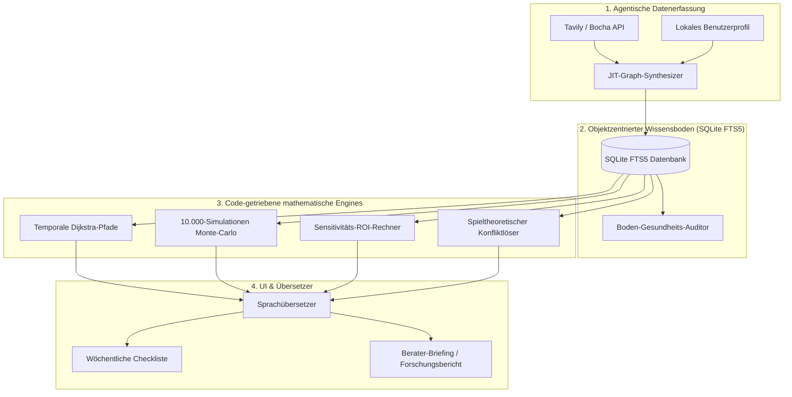

# LifeTree (人生树) — Persönliches Entscheidungs-Intelligenz-Betriebssystem (Life OS)

<p align="center">
  
</p>

<p align="center">
  <strong>Objektzentriertes Temporales GraphRAG & Code-getriebenes Monte-Carlo-Entscheidungs-Betriebssystem</strong>
</p>

<p align="center">
  <a href="README.md"><strong>English</strong></a> | 
  <a href="README_zh.md"><strong>简体中文</strong></a> | 
  <a href="README_de.md"><strong>Deutsch</strong></a>
</p>

<p align="center">
  <a href="#-inhaltsverzeichnis"></a>
  <a href="#-architektur--technologie-stack"></a>
  <a href="#-hauptinnovationen"></a>
  <a href="#-lizenz"></a>
</p>

---

## 📖 Inhaltsverzeichnis

- [🤖 Leitfaden für KI-Agenten zur Nutzung dieses Skills](#-leitfaden-für-ki-agenten-zur-nutzung-dieses-skills)
- [🌟 Systemphilosophie & Metapher](#-systemphilosophie--metapher)
- [🏗️ Architektur & Technologie-Stack](#️-architektur--technologie-stack)
- [🚀 Hauptinnovationen](#-hauptinnovationen)
- [📁 Repository- & Skill-Struktur](#-repository--und-skill-struktur)
- [💻 Schnellstart & Ausführung](#-schnellstart--ausführung)
- [📄 Lizenz](#-lizenz)

---

## 🤖 Leitfaden für KI-Agenten zur Nutzung dieses Skills

Wenn ein KI-Agent mit der Lösung komplexer persönlicher Entscheidungen beauftragt wird, muss er folgendem **5-Schritte-Protokoll** folgen:

### Schritt 1: Skill-Direktiven lesen
Lesen Sie zuerst `SKILL.md`, um Domänenregeln, das lokale SQLite-Schema und Python-Engines zu verstehen.

### Schritt 2: Lokale SQLite-Datenbank abfragen
Suchen Sie über FTS5-Volltextsuche in der lokalen Datenbank:
```bash
python3 scripts/graph_engines/sqlite_graph_store.py "blocked account"
```

### Schritt 3: Agentische Websuche & JIT-Datenverarbeitung
Nutzen Sie Tavily / Bocha, um aktuelle Gesetze abzurufen, und synthetisieren Sie Fakten in den Graphen:
```bash
python3 scripts/data_connectors/search_connector_tavily.py "Germany chanceskarte statutory deposit 2026"
python3 scripts/data_connectors/jit_connector_synthesizer.py
```

### Schritt 4: Code-getriebene mathematische Engines ausführen (PFLICHT)
> [!IMPORTANT]
> **NIEMALS MATHEMATIK DURCH LLM-TEXTGENERATION SCHÄTZEN**:
> Führen Sie immer die Python-Skripte in `scripts/` aus:
```bash
python3 scripts/graph_engines/temporal_graph_engine.py
python3 scripts/simulation_engines/monte_carlo_decision_engine.py
python3 scripts/decision_analysis/graph_sensitivity_engine.py
python3 scripts/decision_analysis/game_theory_stakeholder_solver.py
```

### Schritt 5: In verständliche Sprache & wöchentliche Checkliste übersetzen
Übersetzen Sie mathematische Werte in verständliche Übersichten und erstellen Sie wöchentliche Aufgaben:
```bash
python3 scripts/ui_translators/human_translator.py
python3 scripts/ui_translators/action_checklist_generator.py
```

---

## 🌟 Systemphilosophie & Metapher

LifeTree (人生树) ist ein **Persönliches Entscheidungs-Intelligenz-Betriebssystem (Life OS)**. Es verbindet öffentliche Regelwerke, Wirtschaftstrends und persönliche Entscheidungen in einer dynamischen Baumarchitektur.

- **Der Boden / Das Netz (网/土壤)**: Gesetze, Steuergesetze und Marktbedingungen als Wissensnetz.
- **Der Baum / Das Schicksal (树/命运)**: Das persönliche Profil und Entscheidungen, die wie ein Baum im Boden wachsen.

---

## 🏗️ Architektur & Technologie-Stack



---

## 📄 Lizenz

Dieses Projekt ist unter der **MIT-Lizenz** lizenziert - siehe [LICENSE](LICENSE) für Details.
