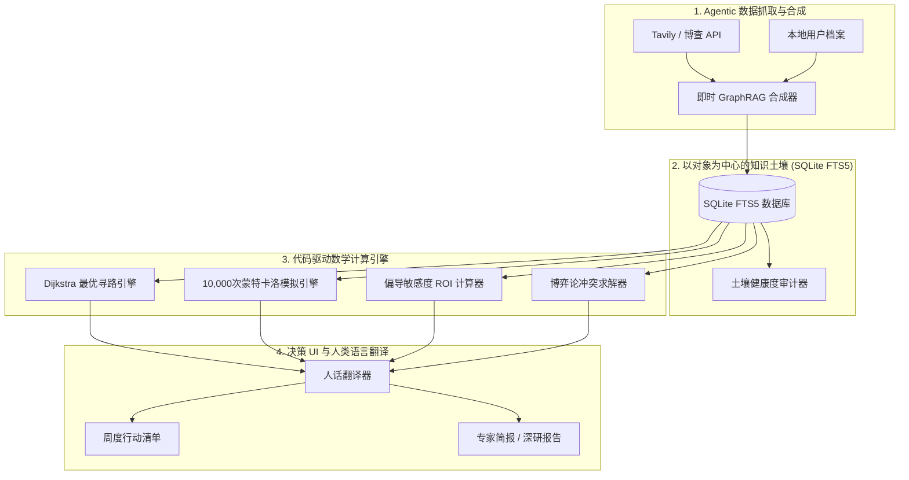

# LifeTree (人生树) — 个人决策智能操作系统 (Life OS)

<p align="center">
  
</p>

<p align="center">
  <strong>基于以对象为中心的时序 GraphRAG 与代码驱动蒙特卡洛模拟的个人决策操作系统</strong>
</p>

<p align="center">
  <a href="README.md"><strong>English</strong></a> | 
  <a href="README_zh.md"><strong>简体中文</strong></a> | 
  <a href="README_de.md"><strong>Deutsch</strong></a>
</p>

<p align="center">
  <a href="#-目录"></a>
  <a href="#-架构与技术栈"></a>
  <a href="#-核心创新点"></a>
  <a href="#-开源协议"></a>
</p>

---

## 📖 目录

- [🤖 AI Agent 使用此 Skill 指导说明](#-ai-agent-使用此-skill-指导说明)
- [🌟 系统哲学与隐喻](#-系统哲学与隐喻)
- [🏗️ 架构与技术栈](#️-架构与技术栈)
- [🚀 核心创新点](#-核心创新点)
- [📁 项目与 Skill 目录结构](#-项目与-skill-目录结构)
- [💻 快速开始与引擎运行](#-快速开始与引擎运行)
- [📄 开源协议](#-开源协议)

---

## 🤖 AI Agent 使用此 Skill 指导说明

当 AI Agent 被分配用于解决复杂的个人高风险决策（如全球身份规划、资产配置、职业转型、跨国避税）时，**必须严格遵循以下 5 步操作规程**：

### 第 1 步：读取 Skill 指令
首先阅读 `SKILL.md`，理解领域规则、本地 SQLite 数据库 Schema 以及 Python 计算引擎位置。

### 第 2 步：检索嵌入式本地 SQLite 数据库
在向用户重复询问之前，先通过 FTS5 全文检索本地已有的知识图谱节点：
```bash
python3 scripts/graph_engines/sqlite_graph_store.py "blocked account"
```

### 第 3 步：运行 Agent 联网检索与即时 GraphRAG 合成
使用 Tavily / 博查 搜索工具获取最新的法定政策法规，并将事实合成入本体图谱：
```bash
python3 scripts/data_connectors/search_connector_tavily.py "Germany chanceskarte statutory deposit 2026"
python3 scripts/data_connectors/jit_connector_synthesizer.py
```

### 第 4 步：执行代码驱动数学计算引擎（强制规程）
> [!IMPORTANT]
> **严禁大模型通过文本生成盲估数学指标**：
> 必须显式运行 `scripts/` 中的 Python 脚本来计算最短路径、蒙特卡洛模拟、敏感度 ROI 以及 VaR 资金限额：
```bash
# 1. 计算 Dijkstra 最优路径与风险级联传导
python3 scripts/graph_engines/temporal_graph_engine.py

# 2. 运行 10,000 次蒙特卡洛随机模拟与 95% 在险价值 (VaR)
python3 scripts/simulation_engines/monte_carlo_decision_engine.py

# 3. 计算偏导敏感度弹性与个人行动 ROI
python3 scripts/decision_analysis/graph_sensitivity_engine.py

# 4. 求解博弈论多利益相关者冲突死锁
python3 scripts/decision_analysis/game_theory_stakeholder_solver.py
```

### 第 5 步：翻译为人类直观摘要与周度行动清单
将复杂的运筹学指标自动翻译为直观的执行摘要，并生成带截止日期的周度 To-Do 清单：
```bash
python3 scripts/ui_translators/human_translator.py
python3 scripts/ui_translators/action_checklist_generator.py
```

---

## 🌟 系统哲学与隐喻

LifeTree (人生树) 是新一代 **个人决策智能 (PDI) 操作系统 (Life OS)**。它将公共政策网络、宏观经济趋势、法定法规与个人人生选择融入动态树状决策架构中，具备实时风险对冲、代码驱动随机预测与博弈论冲突求解能力。

- **网 / 土壤 (The Soil / Network)**：客观存在的政策、法规、税法、地缘冲突构成的复杂因果关系网。
- **树 / 命运 (The Tree / Fate)**：用户个人背景与决策分支，像树木一样在知识土壤中向未来生长抽枝。
- **核心主张**：*“网”负责提供客观事实与阻力，“树”负责呈现个人选择与可能性，让每一次人生抉择都拥有可控的“备用侧芽”。*

---

## 🏗️ 架构与技术栈



### 🛠️ 技术栈规格说明

| 组件 | 技术选型 | 说明 |
| :--- | :--- | :--- |
| **核心逻辑** | Python 3.10+ | 零外部依赖、模块化计算与推理引擎 |
| **本地存储** | SQLite3 + FTS5 | 包含 WAL 并发模式与全文模糊检索的嵌入式数据库 |
| **图算法** | Dijkstra & BFS | 最低摩擦因果路径寻路与 N-hop 风险级联传导 |
| **随机预测** | 蒙特卡洛模拟 (10k) | 高斯时缓噪声与对数正态成本通胀模型 |
| **联网检索** | Tavily & 博查 API | 指定域名过滤与 `/extract` 网页深度解析 |
| **决策科学** | 博弈论与帕累托 | 帕累托最优妥协求解器与 ROI 偏导弹性计算 |

---

## 🚀 核心创新点

> [!IMPORTANT]
> **严格代码驱动计算规程**：
> 所有概率模拟、95% 在险价值 (VaR)、Dijkstra 寻路与权衡得分，必须严格通过运行 `scripts/` 中的 Python 工具或查询本地 SQLite 数据库得出，绝不依赖大模型生成文本盲估！

---

## 📁 项目与 Skill 目录结构

```
lifetree/
├── SKILL.md                            # master 权威执行指令
├── README.md                           # 全量技术手册 (英文)
├── README_zh.md                        # 全量技术手册 (简体中文)
├── README_de.md                        # 全量技术手册 (德文)
├── scripts/                            # 23 个分类 Python 计算引擎
│   ├── graph_engines/                  # 图谱寻路与 SQLite 存储
│   ├── simulation_engines/             # 蒙特卡洛模拟与多年期推演
│   ├── decision_analysis/              # 敏感度、博弈论与矩阵分析
│   ├── risk_surveillance/              # 隐性风险脑暴与持续跟踪
│   ├── data_connectors/                # 联网检索与记忆连接器
│   ├── ui_translators/                 # 人言翻译器与行动清单
│   └── run_mvp_workflow.py             # 10 阶段 MVP 流程一键运行脚本
├── resources/                          # 结构化资源库 (Schema / DB / 模板)
├── references/                         # 21 篇分类架构规范子文档
└── examples/                          # 示例数据与使用样例
```

---

## 💻 快速开始与引擎运行

### 运行端到端 MVP 决策流程闭环
```bash
python3 .agent/skills/lifetree/scripts/run_mvp_workflow.py
```

---

## 📄 开源协议

本项目采用 **MIT 开源协议** - 详见 [LICENSE](LICENSE) 文件。
